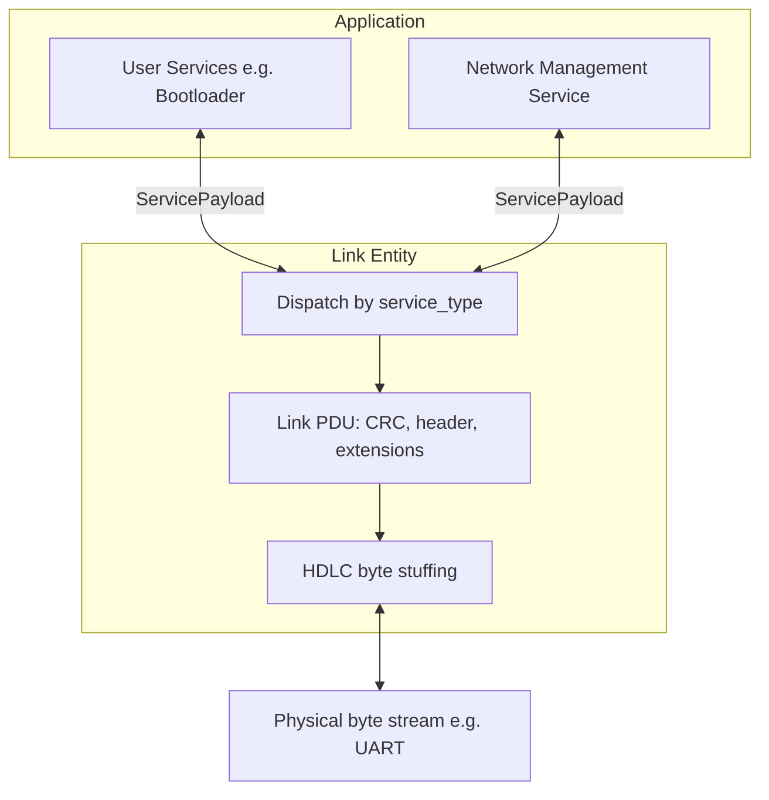
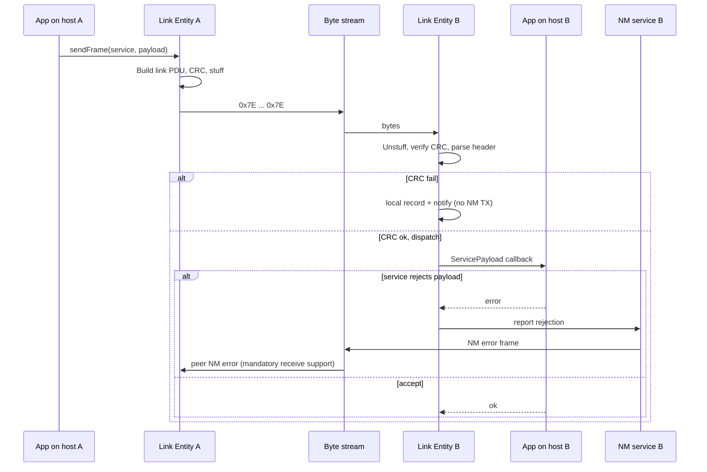

# HDLC Service Protocol --- High-Level Design

## Purpose

This protocol provides a small, reusable communication framework for embedded systems using HDLC-style framing and encoding.

The HDLC layer provides an unreliable datagram service with framing, integrity checking, and service dispatch. Higher OSI-model responsibilities are intentionally delegated to **Services**. Each Service defines the transport and application semantics appropriate to its use case.

The initial use cases are the `BootloaderCommand` and `BootloaderSegment` Service, but the protocol is intended to be versatile and extensible.

## Design Goals

-   Small and deterministic implementation suitable for embedded targets.
-   Common framing usable by multiple independent Services.
-   Keep service-specific semantics out of the HDLC layer.
-   Permit future header extensions without changing existing frame or CRC semantics.
-   Support zero-copy/span-oriented parsing where practical.
-   Detect corrupted frames before interpreting service-specific content.

## Layering

| Layer              | Component                     | Comments                              |
|------------------- |-------------------------------|---------------------------------------|
| Application        | Service                       | e.g. BootloaderCmd, Telemetry         |
| Transport          | Reliable delivery             | Not present, or provided by Service   |
| Logical Link Layer | Optional link addressing      | Via a future header extension         |
|                    | Service Dispatch              | via 8-bit Service ID                  |
|                    | Flow control                  | log2 of available RX size in each frame | 
|                    | HDLC Framing + CRC-16         | CRC-16/CCITT-FALSE                    |
| Physical           | UART or other byte-stream transport  | Not specified by this protocol        |


The HDLC protocol does **not** provide a general-purpose transport protocol. Reliability, request/response behavior, sequencing, fragmentation, acknowledgements, and application messages are defined by individual Services as needed.

### Component overview 


## HDLC Encoding / Decoding

Frames on the wire are delimited by the flag byte `0x7E`. Between flags, any occurrence of `0x7E` or `0x7D` in the data is escaped by inserting `0x7D` and transmitting the original byte XOR `0x20` (same rules as common HDLC/PPP-style framing). The decoder reverses this process to recover the **decoded PDU** described in [Frame Format](#frame-format).

This document does not restate the full standard; treat the above as the profile used by this stack. The protocol specifies a maximum **decoded** frame size only (see below), not a maximum stuffed size on the wire. In the worst case, stuffing can approach ~2× the decoded length (every data byte escaped).

If more than `MAX_PROTOCOL_FRAME_SIZE` decoded bytes are observed before the closing flag, the receiver shall discard the oversized frame and continue discarding until the next flag. The condition is reported locally as an oversized-frame error.

## Frame Format

After HDLC decoding/unescaping, a frame has the following logical format:

``` text
+----------+---------------+----------------+------------------+
|      Base Header         | Extensions     | Service Payload  |
| CRC-16   | Frame Control |                |                  |
| 2 bytes  |  2 bytes      | 0..N bytes     | 0..M bytes       |
+----------+---------------+----------------+------------------+
           <------------ CRC coverage ------------------------->
```

* Little-endian encoding is used for all multi-byte fields
* `MAX_PROTOCOL_FRAME_SIZE` is 4095 decoded bytes including CRC. This keeps the CRC-covered portion at <= 4093 bytes, preserving the selected minimum Hamming-distance guarantee of CRC-16/CCITT-FALSE.
* A maximum-size legal frame is divided into:
  - Fixed (CRC + FrameControl)    =    4 bytes
  - N (size of `Extensions`)     <=   40 bytes
  - M (size of `ServicePayload`) <= 4051 bytes
* Implementations are not required to buffer the protocol maximum. All compliant hosts shall support at least `MIN_REQUIRED_PAYLOAD_CAPACITY` bytes of Service Payload:
  - N (size of `Extensions`)     >=     0 bytes (hosts don't need to support any extensions)
  - `MIN_REQUIRED_PAYLOAD_CAPACITY` = TBD bytes
    - TBD: The purpose of a guaranteed minimum is so we can define good default buffer sizes that work with most services and have affordable RAM footprint on MCUs. We are only targetting 32-bit MCUs and assume RAM is not ultra-constrained (probably at least 32 kB total, usually much more?)
    - TBD: Initial guess is somewhere in the range of [100, 512] might be good
* Services typically (but not necessarily) expect a fixed, non-zero Service Payload length.
* Services may validate the length of the delivered payload and can reject a payload (an error is returned to the protocol stack)
   - The Network Management service should then automatically send an appropriate error message (design of this is still WIP)
   - The error should also be surfaced to the application (callback or polled state), and logged if text logging is available

### Base Header

The base frame header is always 4 bytes total:

| Field          | Width    | Description                                                |
|:---------------|:---------|:-----------------------------------------------------------|
| `crc16`        | 16 bits  | CRC of every decoded frame byte following this field       |
| `service_type` | 8 bits   | Identifies the Service that owns the payload               |
| `extensions`   | 4 bits   | Bitfield of optional header extensions; zero by default    |
| `flow_control` | 4 bits   | floor(log2) of number of words the receiver can receive    |

For the two 4-bit fields, `extensions` is the high nibble; `flow_control` is the low nibble.

## CRC Semantics

CRC behavior is invariant across all Services and header extensions. The CRC is the first field in the decoded frame, and it covers every remaining decoded byte through the end of the HDLC frame: `CRC(frame[2 .. end])`.

Consequently:

-   CRC verification does not require parsing the Service or extensions.
-   Adding an extension only increases the CRC-covered span.
-   Corruption of `service_type`, `extensions`, extension contents, or payload is covered by the CRC.
-   Service-specific parsing occurs only after successful frame integrity validation.

The CRC-16 algorithm used is always CRC-16/CCITT-FALSE.

## Flow Control

Flow control using the 4-bit log2 value will be designed and added later in the protocol development (but before the first mainline release). Pre-release versions will ignore the flow control field; services need to prevent receiver buffer exhaustion by other means.
- For bootloader MVP, use stop-and-wait ack/retry for all commands and segments
- Allow segment streaming and small windowed retry to the bootloader services post-MVP

## Header Extensions

Optional header fields immediately follow the fixed base header. The `extensions` field indicates which extensions are present. `extensions == 0` represents the base frame format and incurs no extension overhead. Each extension that is present is indicated by a single bit. The size of a particular extension is a fixed value. The sum of the sizes of all defined extensions shall not exceed 40 bytes. 

This 40 byte limit is arbitrary and could be revised before the design is frozen. The rationale for choosing it is that we want to set a maximum size for the frame based on the CRC performance, and 40 is both 1) an insignificant percentage of the available frame space, and 2) very large relative to the types of extensions that are likely to be added. For example, the addressing header extension shown below would only need 4 bytes.

### Header Extension Table

No header extensions are defined yet. This table will be the authoratative source for extensions if they are defined in future protocol versions. 

| Extension Bit  | Extension Size | Extension Name |
|:---------------|:---------------|:---------------|
| 3 (MSB)        | TBD            | NA / reserved  |
| 2              | TBD            | NA / reserved  |
| 1              | TBD            | NA / reserved  |
| 0 (LSB)        | TBD            | NA / reserved  |


### Header Concatenation

One possible future extension is addressing, for multi-drop communication. As an example of header extension (not as a concrete design proposal), consider the following hypothetical *Addressing Extension Header* (4 bytes):
| Field             | Width    | Description                                            |
|:------------------|:---------|:-------------------------------------------------------|
| `source_addr`     | 16 bits  | Identifies the host that sent this frame               |
| `destination_addr`| 16 bits  | Identifies the hosts that should consume this frame    |

Header extension bytes shall be concatenated after the base header in order from LSB to MSB of `extensions`. Header extensions will likely all be 2-byte aligned, but that is not defined yet. Unknown or unsupported extension combinations shall cause the frame to be rejected rather than guessed or partially interpreted.

Here is an example of a full frame with the hypothetical *Addressing Extension Header* enabled:
| Field             | Size     | Value (if relevant) |
|:------------------|:---------|:-------|
| `crc16`           | 16 bits  | -      |
| `service_type`    | 8 bits   | -      |
| `extensions`      | 4 bits   | 0010 *(example value if (AddressExtension := (1 << 1U))*  |
| `flow_control`    | 4 bits   | -      |
| `source_addr`     | 16 bits  | -      |
| `destination_addr`| 16 bits  | -      |
| `payload`         | Defined by `service_type` | - |


## Services

A Service is selected by `service_type` and determines which endpoint a valid frame is dispatched to. An application program might use multiple Services, such as `BootloaderCommand` and `BootloaderSegment`. A Service owns all semantics of the Service payload.

In addition to defining the application layer, the Service may provide any functions it requires which are not in the HDLC protocol, such as:
-   sequencing or transaction identifiers;
-   fragmentation/reassembly;
-   retransmission or reliability behavior;

Services don't receive the base protocol header; they only receive the `ServicePayload`. Whether or not services will receive certain header extensions, and the semantics of doing so, will be defined when the given header extension bit is defined.

### Service ID allocation

Each frame’s `service_type` is an 8-bit ID in **`[1, 255]`**. **`0` is forbidden** (treat as unset or parse error). IDs are grouped by **the upper four bits** (`id >> 4`), except that the `0x0*` byte is split: only **`0x01`–`0x0F`** are valid **intrinsic** IDs; **`0x00`** remains invalid.

| Range (hex)   | Decimal   | Quantity    | Category    | Who defines IDs                         |
|---------------|-----------|-------------|-------------|-----------------------------------------|
| `0x00`        | 0         | 1           | *(invalid)* | —                                       |
| `0x01`–`0x0F` | 1–15      | 15          | Intrinsic   | Protocol spec (optional stack features) |
| `0x10`–`0x2F` | 16–47     | 32          | Common      | Firmware platform libraries (shared)    |
| `0x30`–`0x9F` | 48–159    | 112         | Reserved    | Future protocol revisions               |
| `0xA0`–`0xDF` | 160–223   | 64          | Project (stable) | Per product; documented for sustained firmware |
| `0xE0`–`0xFF` | 224–255   | 32          | Project (ephemeral) | Bring-up and experiments only; not stable |

**Intrinsic** services ship with the link stack (e.g. Network Management). **Common** services are reusable across projects (e.g. bootloader) with stable IDs in this document.

**Project (stable)** IDs are assigned for a specific product or board and documented in that product’s materials (README, host config). They are not globally unique across unrelated projects. The stable band is **`0xA0`–`0xDF` (64 IDs)**. If more stable IDs are needed later, the stable band may **expand downward** into the Reserved range (`0x30`–`0x9F`) in a future spec revision; the ephemeral band at the top of the address space stays fixed.

**Project (ephemeral)** IDs occupy **`0xE0`–`0xFF` (32 IDs)** — the highest values. Use them for temporary services during development. They are not reserved, may collide across branches or developers, and must not be documented as release interfaces. When a service outgrows MVP, assign a new ID in the stable band and stop using the ephemeral ID (update host tools and firmware; the old ID may be left unhandled or rejected).

Unknown or unsupported IDs are reported via Network Management (`Unsupported service type`).

#### Intrinsic service registry

Provided by the protocol implementation. `NetworkManagement` is mandatory; additional intrinsic services are expected to be **optional** at compile or run time.

| ID (dec) | ID (hex) | Name                | Purpose                                      |
|----------|----------|---------------------|----------------------------------------------|
| 1        | `0x01`   | NetworkManagement   | Mandatory protocol error reporting           |
| 2–15     | `0x02`–`0x0F` | —            | Reserved                                     |

#### Common service registry

Provided by optional `Firmware/` libraries. Host and MCU must agree on which common services are enabled on a given link.

| ID (dec) | ID (hex) | Name                | Purpose                                                |
|----------|----------|---------------------|--------------------------------------------------------|
| 16       | `0x10`   | BootloaderCommand   | Client ↔ bootloader traffic except memory segments       |
| 17       | `0x11`   | BootloaderSegment   | Client ↔ bootloader memory segment transfers           |
| 18–47    | `0x12`–`0x2F` | —            | Reserved for future platform services                  |

#### Project services

Project-local IDs are split into two sub-ranges:

| Sub-range (hex) | Decimal   | Role | Guidance |
|-----------------|-----------|------|----------|
| `0xA0`–`0xDF` | 160–223 | **Stable** | Document per product; use in release host tools and sustained firmware |
| `0xE0`–`0xFF` | 224–255 | **Ephemeral** | Prototyping only; collision risk; never treat as a shipping contract |

No central registry is required. **Graduation** from ephemeral to stable means picking an unused stable ID, updating product documentation and clients, and abandoning the ephemeral ID — not redefining the ephemeral byte in place.

Future spec revisions may enlarge the stable band downward into **`0x30`–`0x9F`** (Reserved). **`0xE0`–`0xFF` remains ephemeral** so experiments always use the same high sandbox regardless of how large the stable band grows.

## Network Management Service

Network Management (NM) is a mandatory normal **Service** (`service_type` reserved for protocol control; see `protocol.h`). Every compliant implementation shall support the defined NM protocol error messages. User services (bootloader, telemetry, etc.) remain unaware of NM on the wire. For example, if a service rejects a payload delivered by the LinkEntity due to an invalid length, NM records and reports the protocol error when the error is defined as peer-directed.

### Responsibilities

**Wire messages (peer-directed)**  
All NM frames on the link are **sent by the NM service** as ordinary link frames (base header + NM service payload). No other component emits NM payloads directly.

Typical **triggers** for an NM TX:

| Trigger | Source | Example NM message |
|---------|--------|-------------------|
| Link parse / dispatch failure | Link Entity or Receiver after a valid CRC | Unsupported service type, unsupported extensions |
| No handler for `service_type` | Link Entity | Unsupported service type (includes offending ID) |
| Service rejects payload | User service returns an error from a Link Entity API (e.g. `receivePayload` / service callback) | Payload rejected (length or service rules) |

The Link Entity detects the condition, notifies the NM module, and **NM formats and transmits** the response frame.

**Local-only (not sent to peer)**

- **CRC mismatch** and other failures before a well-formed PDU is available: record locally, log, and surface to the application (callback or polled state). **Do not** send individual CRC error reports to the peer. An optional Metrics Service may report aggregate counts.
- Other local RX state (framing errors, buffer overrun) follows the same policy unless explicitly added later.

**Application visibility**  
Errors that result in an NM TX to the peer should also be visible locally (callback or polled state, and logging when enabled). Local-only errors use the same application-facing diagnostics path where practical, without generating a peer NM frame.

### Message model (conceptual)

NM payloads use a small typed record style, e.g. **{message kind, value}**:

- **Errors:** `{UnsupportedServiceType, service_id}`, `{UnsupportedExtension, extension_bitmask}`, `{PayloadRejected, ...}`, etc.

Every compliant implementation shall be able to receive the mandatory NM error messages. An NM error shall **never generate another NM error response**, preventing error-response loops.

Exact opcodes, sizes, and endianness are **not fixed in this document** (see TODOs below).

### Addressing extension interaction

Most NM messages are defined to behave **the same with or without** the addressing header extension present on the triggering frame:

- **Unsupported service type** includes the offending `service_type` in the NM payload so the sender can correlate the error with what they transmitted.
- If a peer sends a frame **with** addressing to a host that does not implement that extension, the host responds with **Unsupported extension** (NM), typically **without** addressing on the reply.
- Intended deployment on a multi-drop link: **all peers use addressing, or none do**; mixed mode is not a design goal.

## Optional Protocol Services

Features that are useful across applications but are not required for basic link interoperability shall be implemented as separate optional Services rather than expanding mandatory Network Management.

Possible optional Services include:

- **Capability discovery:** supported `service_type` values, supported header extensions, and maximum Service Payload capacity.
- **Link health:** application-facing connection / compatibility state and related link-health semantics.
- **Metrics:** low-rate TX/RX counts, bad CRC count, oversize and unsupported-type/extension counts, UART RX high-water or overrun.
- **Link configuration:** optional runtime configuration such as extensions, flow control, or baud rate.

Exact Service IDs, message formats, and behavior for these optional Services are not defined yet.

### Network Management — open items / TODOs

- Define **payload layout** for each mandatory error message kind (size, versioning, max NM payload length).
- Complete list of **error kinds** and which are peer-TX vs local-only (CRC confirmed local-only).
- Link Entity ↔ NM **API**: how Receiver/Link Entity signals each condition; exact service callback signature for payload rejection.
- Define behavior for malformed or otherwise invalid NM error payloads; they are handled locally and shall not generate another NM error.


## Receive Processing

A receiver conceptually performs:

1.  Detect and decode an HDLC frame.
2.  Validate the minimum base-frame size.
3.  Read the fixed-position CRC.
4.  Compute CRC over all remaining decoded bytes and reject on mismatch.
5.  Parse the fixed base header.
6.  Validate and parse indicated header extensions.
7.  Determine the Service payload span.
8.  Dispatch the payload to the selected Service.
9.  Allow the Service to perform any additional transport/application
    validation.

This ordering ensures that variable or Service-specific fields are not trusted before frame integrity has been established.

### End-to-end path diagram


